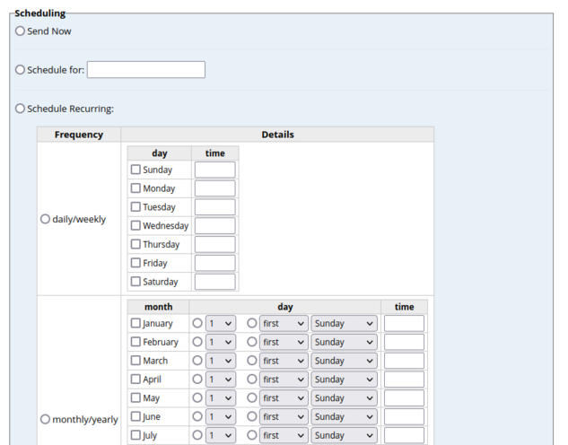
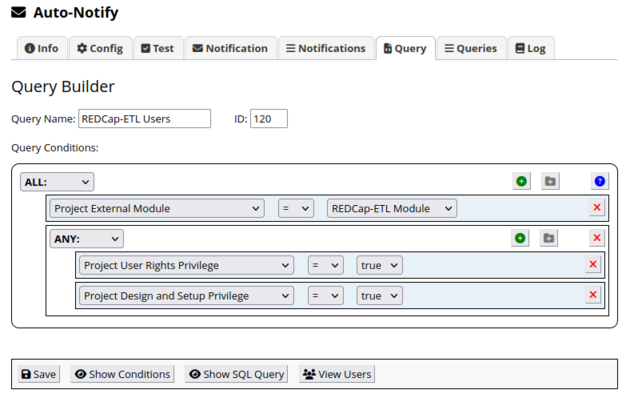
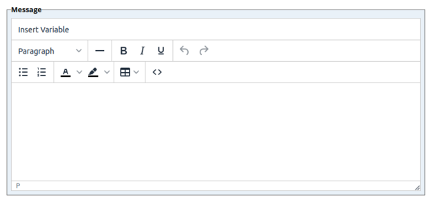

<!-- =================================================
Copyright (C) 2023 The Trustees of Indiana University
SPDX-License-Identifier: BSD-3-Clause
================================================== -->

Auto-Notify Module
=========================

The Auto-Notify Module is a REDCap external module that enables admins to send e-mail notifications to users.

Auto-Notify is similar to the E-mail Users functionality
built into REDCap, but it was developed to provide the following additional features:

* **Scheduling.** Notifications can be scheduled to be sent at a future time or recurringly.
* **Flexible Specification of Recipients.** Notification recipients can be specified using built-in forms or custom queries
    created using a query builder.
* **Message Variables.** Notification messages can contain variables, e.g., [last_name] for the recipient's last name.

Since Auto-Notify was originally developed, message variables (called "dynamic variables") have been added
to REDCap's Email Users page, and it is possible that more of the above features will be added in the future.

The interface for the Auto-Notify external module is accessed through the Control Center in
REDCap. After the module has been installed, there should be a link to
it on the left-hand side of the page in the External Modules section in the Control Center.
There is no project-based interface for this external module.

Scheduling
--------------------------

You can schedule a notification to be sent immediately,
at a future date and time, or recurringly at specified dates and times.
<table align="center">
<tr><th>

</tr></th>
</table>

Recipients
-----------------------------------------------------------

There are 2 ways to specify the recipients of a notification:

1. **Built-In Form.** Use one of the provided forms. Forms exist for API token users and external module users.
2. **Custom Query.** Specify a previously created custom query that generates a set of REDCap users. Custom queries are
    created using this module's Query Builder, which is described below.

### Query Builder
This module provides a query builder that you can use to create
custom queries, which can be used to specify the recipients of notifications.
In the example shown below, the query builder was used to create a query that returns users who
have a project that uses the REDCap-ETL external module, and who have either the
"user rights" privilege or "design and project setup" privilege for that project.

<table align="center">
<tr><th>

</tr></th>
</table>

The query builder can also be used for querying the REDCap database.

Message Variables
-------------------------------

Variables are supported in notification messages. The
notification message editor provides an "Insert Variable" button that can
be used to select and insert a variable into the message.

<table align="center"><tr><th>

</tr></th></table>

Message variables supported include:

<table align="center" width="50%">
    <tr> <th>Name</th> <th>Description</th>
    <tr>
        <td> [first_name] </td>
        <td> The recipient's first name. </td>
    </tr>
    <tr>
        <td> [last_name] </td>
        <td> The recipient's last name. </td>
    </tr>
    <tr>
        <td> [username] </td>
        <td> The recipient's REDCap username. </td>
    </tr>
    <tr>
        <td> [email] </td>
        <td> The recipient's e-mail address. </td>
    </tr>
    <tr>
        <td> [applicable_project_info] </td>
        <td> A table of the recipient's projects that meet the criteria 
             of the notification. For example, if you specified your notification should
             be sent to API token users, then this variable would be replaced with a table
             of information on the recipient's projects where the recipient has an API token.
        </td>
    </tr>
    <tr>
        <td> [redcap_url] </td>
        <td> The URL for the REDCap instance from which the notification was sent. </td>
    </tr>
</table>

